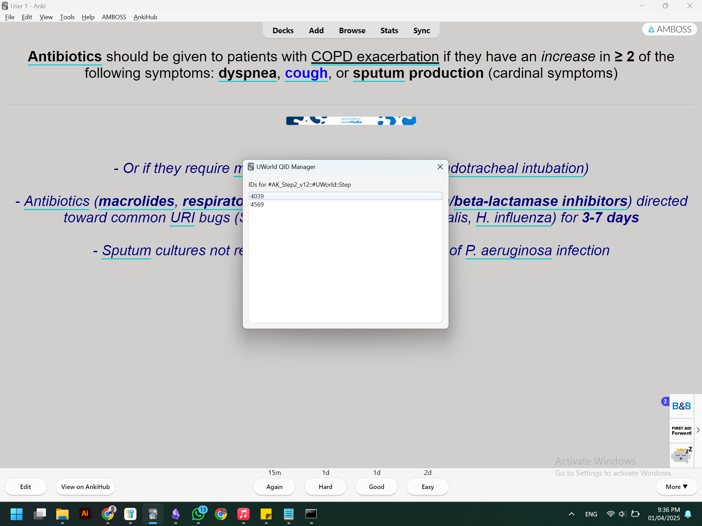
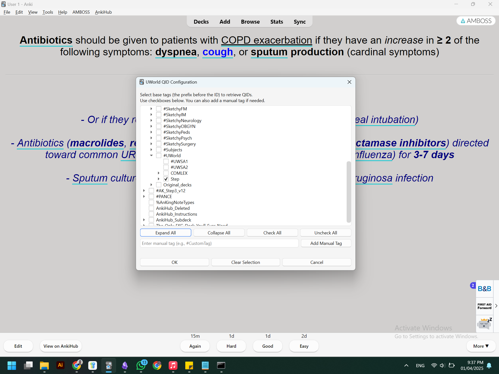

# Anki Question ID Manager

**Anki Question ID Manager** is a powerful and user-friendly add-on for Anki that enhances your study experience by extracting and displaying question IDs embedded in your card tags. 

---

## Features

- **Customizable Tag Extraction:**  
  Easily configure the base tags from which the add-on extracts question IDs.  
  Only retrieves IDs that match your chosen tag prefixes.

- **Hierarchical Tag Selection:**  
  View and select tags in a clear, hierarchical tree view with checkboxes for easy configuration.

- **Manual Tag Entry:**  
  Add any custom tag manually if it's not present in the tag tree.

- **UI Enhancements:**  
  Toggle tree view options with buttons to expand/collapse and check/uncheck all tags.

- **Real-time QID Retrieval:**  
  Extracts and displays all matching question IDs from the currently active card with a clean interface.

- **Separate Configuration and Display Menus:**  
  Configure your tag selection via Tools > **UWorld QID Config** and view the extracted IDs via Tools > **UWorld QID Manager**.

---

## Installation

1. **Download the Add-on:**  
   Clone or download the repository from GitHub:  
   [https://github.com/rad1shayeb/anki-question-id-manager](https://github.com/rad1shayeb/anki-question-id-manager)

2. **Install the Add-on:**  
   - Open Anki.
   - Navigate to **Tools > Add-ons > Open Add-ons Folder**.
   - Copy the entire `anki-question-id-manager` folder into the add-ons directory.
   - Restart Anki.

3. **Configure the Add-on:**  
   - Go to **Tools > UWorld QID Config**.
   - Select the base tags you want to use for QID extraction.
   - Use the provided buttons to manage your selections and save the configuration.

---

## Usage

- **Extracting QIDs:**  
  With your configuration set, open a card in Anki that contains tags matching your base tags followed by a question ID (e.g., `#Tag1::12345`).  
  Access **Tools > UWorld QID Manager** to view all extracted question IDs for the active card. Right-click any ID to copy it to your clipboard.

- **Updating Configuration:**  
  If you need to update your tag selections, go back to **Tools > UWorld QID Config** and make your changes.

---

## Troubleshooting

- **No QIDs Displayed:**  
  - Ensure that your active card has tags formatted as `<base tag>::<ID>`.
  - Verify your configuration in **UWorld QID Config** to ensure the correct base tags are selected.

- **Add-on Not Loading:**  
  - Double-check that the add-on is placed in the correct add-ons folder.
  - Restart Anki after installing or updating the add-on.

For further assistance, refer to the log file (`qid_addon.log`) located in the add-on's directory.

---

## About

**Author:** Radwan Shayeb  
4th Year Medical Student, An-Najah National University  
GitHub: [rad1shayeb](https://github.com/rad1shayeb)
shayebradwan@gmail.com

For more details, see the source code:  
[__init__.py on GitHub](https://github.com/rad1shayeb/anki-question-id-manager/blob/main/__init__.py)

---

